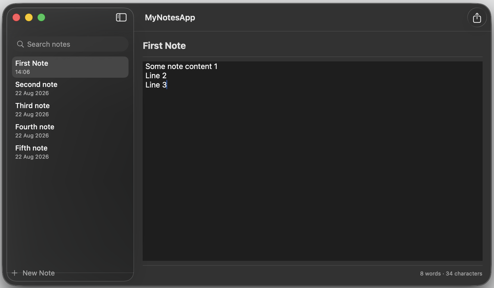
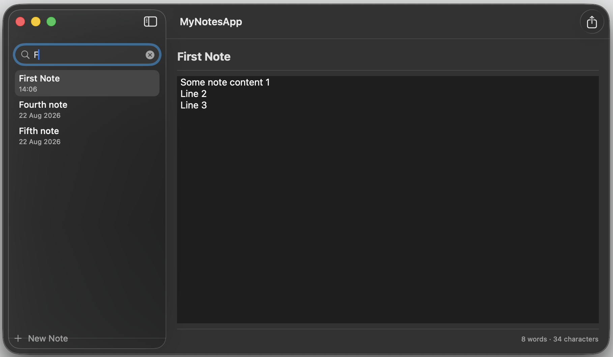
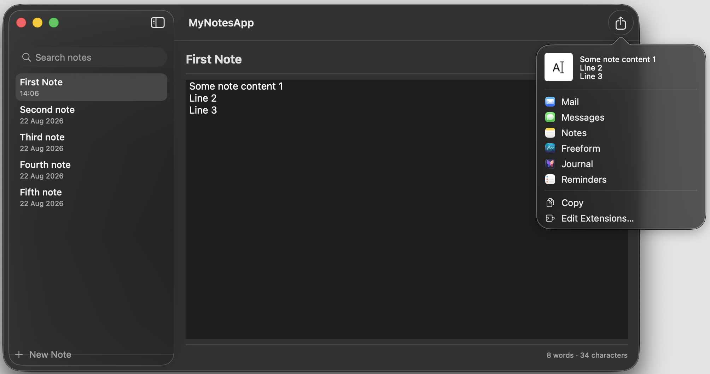
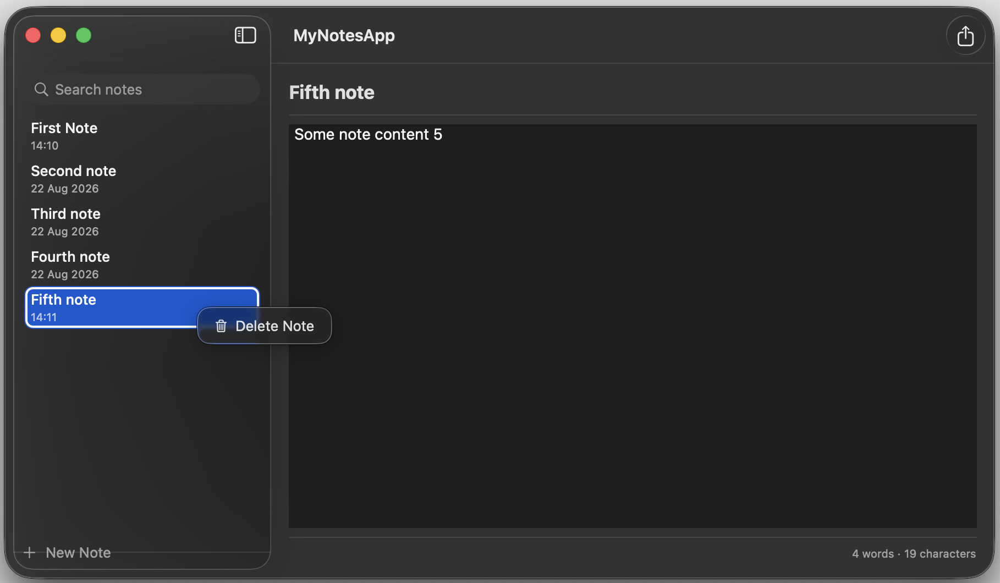

# MyNotesApp

A native macOS notes app built with SwiftUI. Notes are created, searched, and deleted from a sidebar list, then edited as title and body in a plain-text editor with a live word/character count. Notes are autosaved to disk with created/modified timestamps, and can be imported from or exported to `.txt` files, shared via the system share sheet, or opened in their own window.

## Screenshots

<!-- Add screenshots below -->

|                                       |                                       |
| ------------------------------------- | ------------------------------------- |
|  |  |
|  |  |

## Features

- Create, edit, and delete notes in a sidebar list
- Live search across note titles and content
- Automatic saving with created/modified timestamps
- Word and character count for the current note
- Adjustable editor font size
- Open plain text (`.txt`) files as notes
- Export the current note as a `.txt` file
- Share notes via the system share sheet
- Multi-window support (open notes in separate windows)
- Keyboard shortcuts for all common actions (⌘N, ⌘O, ⌘S, ⌘⇧S, ⌘+/⌘-)

